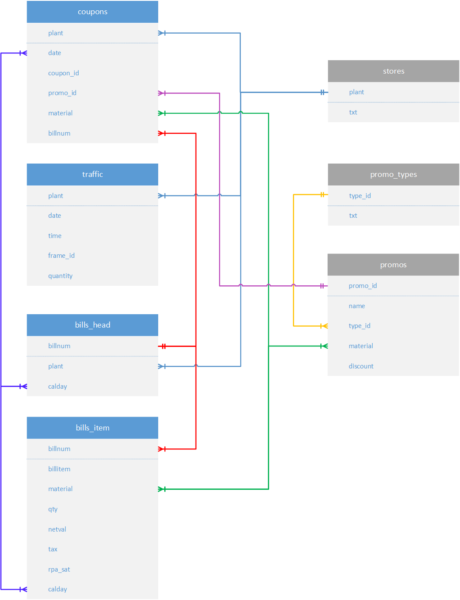
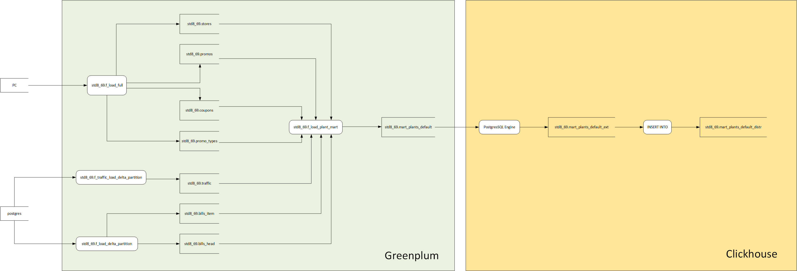
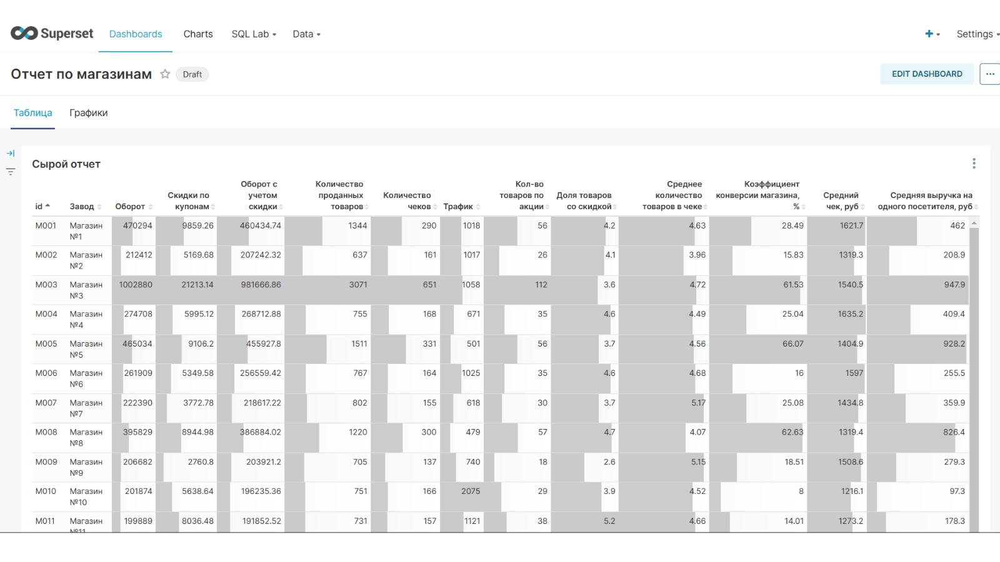

# Sales Data Platform

This project builds a store-performance mart from retail transactions, traffic and promotion data. PostgreSQL provides a lightweight local warehouse, the Greenplum SQL documents the intended MPP layout, and ClickHouse serves the finished mart to BI tools.

The first version was my final project for a Sapiens Solutions Greenplum course. I later rebuilt it as a runnable repository with synthetic data, automated validation and tests.

## Data flow

```text
CSV dimensions + transaction tables
                 |
                 v
        PostgreSQL / Greenplum
                 |
                 v
        store performance mart
                 |
                 v
             ClickHouse

Airflow coordinates the load, mart build and publication stages.
```

The mart contains gross and net revenue, discounts, quantities, receipt counts, traffic, conversion, promotional share and average receipt measures. The name `net_revenue` is deliberate: revenue after discounts is not accounting profit.

## Run the pipeline

Docker with Compose is required.

```bash
docker compose up --build --abort-on-container-exit pipeline
```

The command creates the source and warehouse tables, loads the sample data, builds `sales.mart_store_performance`, validates it and publishes the result to ClickHouse.

Inspect the warehouse mart:

```bash
docker compose exec postgres psql -U sales -d sales -c \
  "select * from sales.mart_store_performance order by plant"
```

Inspect the ClickHouse table:

```bash
docker compose exec clickhouse clickhouse-client --query \
  "select * from sales.mart_store_performance order by plant format PrettyCompact"
```

Use `docker compose down -v` when you want to remove the local containers and their data.

## Design notes

The Greenplum design keeps receipt headers and lines together on `billnum`, replicates small dimensions, partitions facts by date and uses append-optimized column storage for analytical tables. The local PostgreSQL setup does not try to imitate Greenplum distribution; it exists to make the transformations easy to run and test.

The mart starts from the store dimension and joins aggregates with `LEFT JOIN`, so a store does not disappear when traffic or promotion data is absent. Coupon duplicates are resolved deterministically with `row_number()`.

Before publication the pipeline checks:

- uniqueness of business keys and the mart grain;
- non-negative quantities, revenue, traffic and discounts;
- receipt-to-line referential integrity;
- revenue reconciliation with the source lines;
- valid conversion and promotion-rate ranges.

Any failed check stops the pipeline.

## Run individual stages

```bash
python -m sales_pipeline init
python -m sales_pipeline mart
python -m sales_pipeline publish
python -m sales_pipeline all
```

Connection settings come from environment variables listed in `.env.example`.

## Repository layout

```text
dags/               Airflow DAG
docs/               diagrams and dashboard evidence
sample_data/        synthetic retail data
sales_pipeline/     pipeline runner and validation
sql/marts/          portable mart query
sql/postgres/       local schema
sql/greenplum/      target MPP schema
tests/              mart and configuration tests
```

## Checks

```bash
python -m pip install -e ".[dev]"
pytest
ruff check .
ruff format --check .
```

## Screenshots and data

The repository contains synthetic data only. The ER diagram, Airflow graph and Superset screenshot come from the original managed course environment, which is not distributed here.






